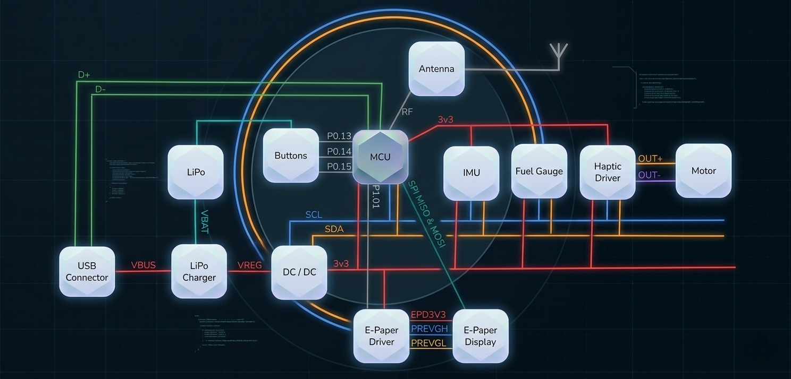

# InkTime - Smartwatch Open Source

**InkTime** este un start-up dedicat crearii unui smartwatch accesibil si open-source. Acest repository contine documentatia tehnica, fisierele de proiectare hardware (schematica si layout PCB), fisierele de productie si modelele 3D necesare pentru fabricarea dispozitivului.

## 1. Diagrama Bloc
Diagrama de mai jos ilustreaza arhitectura sistemului, evidentiind interconexiunile dintre microcontrolerul nRF52840 si modulele periferice (Display, IMU, Alimentare).

 

---

## 2. Bill of Materials (BOM)
Toate componentele au fost selectate pentru a fi compatibile cu asamblarea automata prin JLC PCB.

| Componenta / Modul | Descriere | Link Achizitie (JLC Parts) | Datasheet |
| :--- | :--- | :--- | :--- |
| **nRF52840** | SoC Bluetooth Low Energy | [Link JLC](https://jlcpcb.com/parts) | (https://infocenter.nordicsemi.com/) |
| **Display E-Paper** | Ecran cu consum redus | [Link JLC](https://jlcpcb.com/parts) |(https://jlcpcb.com/parts) |
| **Baterie Li-Po** | 3.7V, conectare directa pe pad-uri | [Link JLC](https://jlcpcb.com/parts) |(https://jlcpcb.com/parts) |
| **Senzor IMU** | Senzor de miscare (Accel/Gyro) | [Link JLC](https://jlcpcb.com/parts) | (https://jlcpcb.com/parts) |
| **Butoane SMD** | Tip 0201/0402 conform cerintelor | [Link JLC](https://jlcpcb.com/parts) |(https://jlcpcb.com/parts) |
| **Condensatoare** | 100nF (0201) / >100nF (0402) | [Link JLC](https://jlcpcb.com/parts) |(https://jlcpcb.com/parts) |

---

## 3. Functionalitate Hardware si Design

### Detalii Tehnice
* **Unitate de procesare:** nRF52840, ales pentru integrarea BLE si eficienta energetica.
* **Interfete de comunicatie:**
    * **SPI:** Utilizat pentru controlul ecranului e-paper pentru rate de refresh optime.
    * **I2C:** Utilizat pentru senzorul IMU si managementul bateriei.
* **Managementul energiei:** PCB-ul include circuite de protectie pentru bateria Li-Po. Consumul a fost optimizat prin utilizarea condensatoarelor de decuplare de 100nF amplasate imediat langa pinii de alimentare. Autonomia a fost calculata avand in vedere starea de sleep si timpii activi ai procesorului si display-ului.
* **PCB Design:** * Grosime PCB: **1mm**.
    * Trasee de putere (VCC, 3V3): **0.3mm**.
    * Trasee de date: **0.15mm**.
    * Plan de masa: Prezent pe ambele straturi (Top/Bottom) cu **Via Stitching** pentru integritatea semnalului radio.

### Mapare Pini nRF52840
| Pin nRF52840 | Componenta | Functie / Justificare |
| :--- | :--- | :--- |
| **P0.xx** | SPI CLK | Clock pentru ecranul e-paper |
| **P0.yy** | I2C SDA | Date pentru senzorul IMU |
| **P0.zz** | Buton 1 | Intrare digitala cu pull-up intern |
| **VBUS** | USB-C | Detectare alimentare si incarcare baterie |

---

## 4. Implementare si Decizii de Proiectare (Design Log)

In cadrul procesului de dezvoltare (EVT/DVT), s-au luat urmatoarele decizii tehnice:
1.  **Amplasare Componente:** Toate componentele au fost plasate pe layer-ul **TOP** pentru a simplifica procesul de fabricatie.
2.  **Antena:** A fost plasata la extremitatea placii, cu planul de masa decupat dedesubt pentru a evita atenuarea semnalului BLE.
3.  **Conectivitate Baterie:** Din ratiuni de spatiu in carcasa, s-a renuntat la conectorul JST, bateria fiind lipita direct pe test pad-urile dedicate.
4.  **Erori Acceptate:** Eroarea DRC "Only INPUT pins on NET ID" a fost ignorata conform specificatiilor, fiind un artefact al bibliotecii de simboluri.
5.  **Mecanica:** Carcasa a fost ajustata in Fusion360 pentru a asigura alinierea perfecta a portului USB-C si a butoanelor fizice.
---

## 5. Structura Repository
* `/Hardware`: Fisiere native Fusion360 (.sch, .brd).
* `/Manufacturing`: Fisiere Gerber, BOM si Pick and Place.
* `/Mechanical`: Modele 3D (STEP/Exploded view) si asamblarea in Fusion360.
* `/Images`: Randari ale produsului finit si ale PCB-ului.

---

## 6. Randari

---

## 7. Licenta
Acest proiect este licentiat sub [Apache License 2.0](LICENSE).
